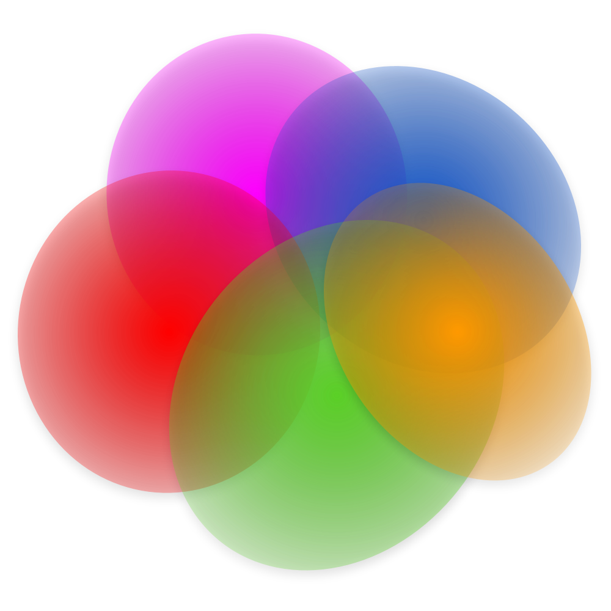
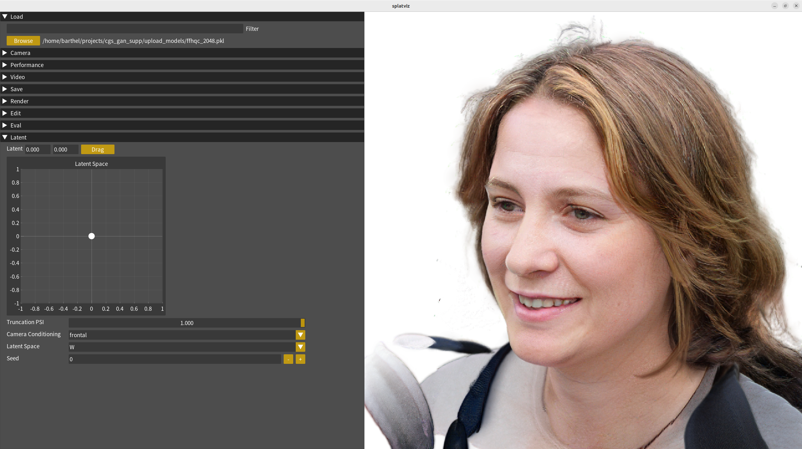

<div align="center">

  <h1> ganviz </h1>

    

</div>


## Install

### 1. Clone

Clone repository **recursively** in order to install glm from the diff_gaussian_rasterization package.

```bash
git clone https://github.com/Florian-Barthel/ganviz.git --recursive
cd ganviz
```


### 2. Install Environment

Create environment with [uv](https://docs.astral.sh/uv/getting-started/installation/):


```shell
uv sync
uv pip install .\diff-gaussian-rasterization\ --no-build-isolation
```

Clone CGS-GAN:
```bash
git clone https://github.com/fraunhoferhhi/cgs_gan.git --single-branch
```
and download a pretrained checkpoint:
[ffhq_512.pkl](https://huggingface.co/Fubei/cgs_gan_checkpoints/resolve/main/ffhqc_512.pkl?download=true)

## Launch

```bash
python run_main.py
```

In some cases you will have to add this variable so that opengl uses the correct version:
`export MESA_GL_VERSION_OVERRIDE=3.3`

## Widgets


### 🧭 Latent Widget
Simply drag the white dot across the 2D plane to interpolate in the latent space of the GAN.
<br>


### Inversion Widget
Invert your own 3D head like in this [video](https://www.linkedin.com/posts/florian-barthel-9583b9208_we-have-just-released-a-new-feature-for-activity-7345716193535614979--nU8?utm_source=share&utm_medium=member_desktop&rcm=ACoAADS9oRQBL7WTKc4KVRY4d66D9oR51YDpUqc)

## ⭐ Recent Features

- 2025-09-21: Inversion Tool
- 2025-09-21: Latent Space widget

## Contribute

You are more than welcome to add further functionality or a better design to this interactive viewer!
The main goal is to create an easy-to-use tool that can be applied for debugging and for understanding
3D Gaussian Splatting objects.
For reformating code please use [black](https://github.com/psf/black) with --line-length 120.

## Citation

If you find this viewer useful, please consider citing our work:

```
@misc{barthel2025cgsgan3dconsistentgaussian,
      title={CGS-GAN: 3D Consistent Gaussian Splatting GANs for High Resolution Human Head Synthesis}, 
      author={Florian Barthel and Wieland Morgenstern and Paul Hinzer and Anna Hilsmann and Peter Eisert},
      year={2025},
      eprint={2505.17590},
      archivePrefix={arXiv},
      primaryClass={cs.CV},
      url={https://arxiv.org/abs/2505.17590}, 
}
```

## References

This viewer is inspired by the visualizer from Efficient Geometry-aware 3D Generative Adversarial
Networks (EG3D).

- GUI: <a href="https://pyimgui.readthedocs.io/en/latest/guide/first-steps.html">pyimgui</a> and
<a href="https://github.com/pthom/imgui_bundle">imgui_bundle</a> which are python wrappers for the c++ library
<a href="https://github.com/ocornut/imgui">ImGUI</a>
- Original code base: <a href="https://github.com/NVlabs/eg3d">EG3D</a>
- 3DGS: <a href="https://repo-sam.inria.fr/fungraph/3d-gaussian-splatting/"> 3D Gaussian Splatting</a>
- Compressing 3DGS scenes: <a href="https://fraunhoferhhi.github.io/Self-Organizing-Gaussians/">Compact 3D Scene
Representation via Self-Organizing Gaussian Grids</a>
- 3DGS Rasterizer with depth and alpha: <a href="https://github.com/slothfulxtx/diff-gaussian-rasterization">Diff
rasterizer with depth and alpha</a>
